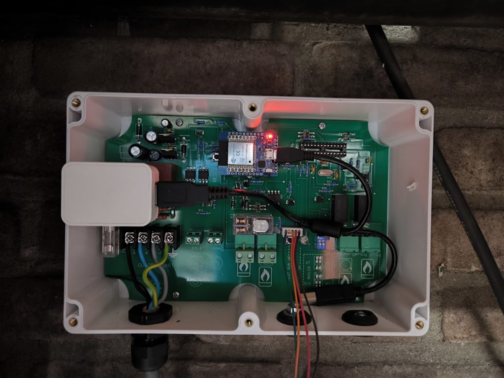

# Aurea WP — de complete controlbox van de Atlantic Aurea vervangen

Alternatieve besturing voor de **Atlantic Aurea 5 Hybrid** warmtepomp (een
kostenbespaarde **Chofu AEYC-0643XU**). In de controlbox zitten twee ATmega8's in
een DIP28-voet. **Dit project vervangt ze allebei**:

| Voet | Origineel | Wordt | Doet |
|---|---|---|---|
| **IC1** | Haddon M1.1 | **ESP32** (MH-ET MiniKit) | praat op 666 baud met de buitenunit, draait de regeling, praat met Home Assistant |
| **IC2** | Haddon T1.1 | **ATmega328P** met eigen firmware | geeft het OpenTherm-gesprek tussen thermostaat en CV-ketel door, en mag onderweg ingrijpen |

Je zegt vanuit Home Assistant *"geef me X °C aanvoer"* en de controller kiest zelf
de stand. De CV-ketel hoeft daarnaast niet meer los aangestuurd te worden: de
brug in IC2 zit tussen je thermostaat en je ketel in, dus je kunt de ketel
**blokkeren** zolang de warmtepomp het alleen aankan — zonder de thermostaat te
misleiden en zonder draden te verleggen.

**Status: werkend op echte hardware.** Beide kanten van de OpenTherm-brug
decoderen frames zonder pariteitsfouten, met een echte thermostaat aan de ene
kant en een CV-ketel aan de andere. De warmtepompkant draait al langer: alle
telegrammen CRC-geldig, en de buitenunit reageert op de gestuurde stand.



---

## De IC2-kant is optioneel

`aurea-wp.yaml` is de volledige opzet. Wil je alleen de warmtepomp en laat je de
IC2-voet leeg, dan ligt er een uitgeklede variant klaar als
[`aurea-wp-minimaal.yaml.example`](aurea-wp-minimaal.yaml.example):

| | minimaal | volledig |
|---|---|---|
| ESP32 in IC1 | ✅ | ✅ |
| Eigen chip in IC2 | — (voet blijft leeg) | ✅ ATmega328P |
| Warmtepomp aansturen | ✅ volledig | ✅ volledig |
| Thermostaat & CV-ketel | los aansturen, zoals voorheen | via de OpenTherm-brug |
| Extra bedrading | alleen GPIO16/17 | + een deler op GPIO19 |

Gebruik hem door hem over `aurea-wp.yaml` heen te kopiëren:

```bash
cp aurea-wp-minimaal.yaml.example aurea-wp.yaml
```

**Handig om mee te beginnen.** Daarmee heb je de warmtepomp compleet in Home
Assistant en weet je zeker dat je bedrading klopt, vóórdat je een chip gaat
branden. Het is ook waar je op terugvalt als er iets mis is met de brug: de
warmtepomp blijft dan gewoon draaien.

Terug naar de volledige opzet is `git checkout aurea-wp.yaml`, gevolgd door
**`esphome clean aurea-wp.yaml`** — ESPHome kiest zijn bouwmap op de
apparaatnaam, dus de bouwmap van de vorige variant blijft anders staan en je
krijgt een linkfout over ontbrekende `aurea_link`-symbolen.

De apparaatnaam blijft in beide gevallen `aurea-wp`. Dat is bewust: Home
Assistant houdt daarmee het apparaat en de geschiedenis van alle sensoren die in
beide varianten zitten, en je krijgt er bij de volledige opzet alleen de
thermostaat- en ketelentiteiten bij.

## Wat je nodig hebt

### Voor IC1 — de warmtepompkant

Een **ESP32**; ontwikkeld op een MH-ET LIVE MiniKit, maar elk ESP32-bord met de
juiste pinnen vrij werkt. Zie [WIRING.md](WIRING.md).

### Voor IC2 — de OpenTherm-brug *(optioneel)*

Sla dit over als je de minimale opzet draait.

Een **ATmega328P-PU in DIP-28**. Dat is dezelfde behuizing als de originele
ATmega8, dus hij past rechtstreeks in de bestaande voet.

> **Waarom een 328P en niet weer een ATmega8?** Dezelfde pinout, dezelfde
> registers, maar viermaal zoveel flash en tweemaal zoveel RAM. Er is geen enkele
> reden om jezelf op 8 kB vast te zetten. De firmware gebruikt nu 6,1 kB — dat
> past nog net in een ATmega8, maar dan is er geen ruimte meer om iets toe te
> voegen.

Wat je verder nodig hebt:

- Iets om de chip mee te branden. Met een **TL866-II** gaat het zeker goed —
  chip in de ZIF-voet, fuses in een venstertje — maar die kost zo'n €80 en
  verdient zichzelf pas terug als je vaker losse chips brandt. Heb je een
  **Arduino Uno** liggen, dan kan het daar in principe ook mee via de
  ArduinoISP-sketch; die route is uitgewerkt maar **nog door niemand
  uitgeprobeerd**. Beide staan in [firmware/README.md](firmware/README.md).
- **Geen kristal.** Onder de IC2-voet zit er al een van 8 MHz, gewoon op de
  print. De firmware is daarop gebouwd.

**De kant-en-klare hex staat in deze repo**, dus je hoeft geen Arduino-toolchain
te installeren:

```
firmware/avr-bridge/avr-bridge.hex
```

Fuses erbij (zie [firmware/README.md](firmware/README.md) voor de uitleg):

| Fuse | Waarde | Betekenis |
|---|---|---|
| lfuse | `0xFF` | extern kristal 8–16 MHz |
| hfuse | `0xD9` | geen bootloader, EESAVE uit |
| efuse | `0xFD` | brown-out op 2,7 V |

> Laat **RSTDISBL** en **DWEN** met rust. Die maken van de resetpin een gewone
> I/O-pin, en dan komt een normale programmer er niet meer bij.

Wil je eerst op het bureau testen, zonder kristal? Zet `lfuse` dan op `0xE2`
(interne RC, 8 MHz). Dezelfde hex werkt in beide gevallen — de klokbron is een
fuse, geen compileeroptie.

### Verbinding tussen de twee

Geen. De sporen tussen de IC1- en IC2-voet liggen al op de print, gekruist, en
dat is precies wat je nodig hebt: GPIO18/19 van de ESP32 op IC1-pin 3 en 2,
9600 baud. Eén weerstandsdeler aan de RX-kant, verder niets.

---

## Wat de brug in IC2 doet

Hij zit **tussen** de thermostaat en de ketel en geeft het OpenTherm-gesprek
letterlijk door, met een paar uitzonderingen die je vanuit Home Assistant
bedient:

- **De bijstook blokkeren.** Aan = de ketel krijgt een setpoint van 10 °C opgelegd en houdt zich
  koest, terwijl de thermostaat gewoon zijn eigen gesprek blijft voeren. De ketel
  wordt dus nooit "uitgezet": tapwater, storingen en diagnostiek blijven werken.
  De AVR houdt zelf een minimale aan- en uittijd van vijf minuten aan zodat er
  niets gaat pendelen.
- **Zelf antwoorden.** Praat de ketel niet mee (of zet je hem bewust buitenspel),
  dan beantwoordt de brug de thermostaat zelf, met de warmtepomp als warmtebron.
- **Temperatuursubstitutie.** De thermostaat de aanvoer/retour van de wármtepomp
  laten zien in plaats van die van de ketel — alleen nodig als de ketelpomp niet
  meedraait en de ketel dus stilstaand koud water meet.

En wat er gebeurt als het misgaat:

**Valt de ESP32 weg, dan trekt de AVR zelf de noodbrug aan.** Op de print zitten
twee relais (K1 en K2) die het complete aderpaar van de thermostaat rechtstreeks
naar de ketel verleggen. Dat is Atlantic's eigen voorziening, en die zit nu in
firmware — dus hij werkt ook als Home Assistant, het netwerk of de ESP32 eruit
ligt. Het huis blijft warm.

De volledige reverse-engineering van beide originele chips staat in een apart
verslag: **[aapje.info/downloads/atlantic](https://aapje.info/downloads/atlantic/)**.
Daar vind je de instructie-voor-instructie analyse van de firmware, en
[de print pin voor pin doorgemeten](https://aapje.info/downloads/atlantic/#print)
— de socket-pinout, de relaistopologie en de twee OpenTherm-interfaces, die
anders dan je zou verwachten niet symmetrisch gebouwd zijn.

---

## Herkomst van het protocol

Het warmtepompprotocol is niet openbaar; het is gereverse-engineerd door de
forumgebruikers **WackoH** en **_JGC_** in het Tweakers-topic *"Aurea 5 hybrid:
interfaces met de buitenunit en thermostaat"*. De protocol-laag hier is geport
uit JGC's werkende ATmega2560-sketch (v0.1Beta, 19-03-2025). Alle credits voor
het uitpluizen gaan naar hen.

De OpenTherm-kant is daarnaast rechtstreeks uit de originele T1.1-firmware
gehaald, met een zelfgeschreven AVR-disassembler.

## Het warmtepompprotocol

| Aspect | Waarde |
|--------|--------|
| Fysiek | 666 baud, 8N1, via 2× H11D1 optocoupler |
| Rollen | **Buitenunit = master** (~500 ms cyclus, ~8 ms startpuls) |
| CRC | CRC-16/CCITT-FALSE (poly 0x1021, init 0xFFFF), big-endian |
| Timing | ESP zendt ~99 ms ná elk ontvangen frame, min. 300 ms tussen TX |

**Zenden (controlbox → WP):** 4 roterende telegrammen. Alleen `data2` verandert;
de rest zijn vaste constanten:

```
data0 = 19 00 08 00 00 00 D9 B5
data1 = 19 01 0C 00 00 00 00 00 00 00 AA 35
data2 = 19 02 08 <modus> <stand> 00 <crc_hi> <crc_lo>   ← het commando
data3 = 19 03 08 B2 02 00 C1 9A
```
`data2` byte 4 = **modus**, byte 5 = **stand** (0–10):

| Modus | Betekenis |
|-------|-----------|
| `0x00` | uit |
| `0x01` | verwarmen |
| `0x02` | **koelen** — ✅ geverifieerd werkend |

> **Koelen werkt echt.** Op het forum stond `0x02` als onbevestigd en JGC's sketch
> gebruikte het nooit. Getest op echte hardware: na het commando startte de
> compressor binnen ~6 s en zakte de aanvoer van 37,8 °C naar 23,8 °C, terwijl de
> retour op 30,0 °C bleef — delta-T van −6,3 °C, dus de aanvoer werd kouder dan de
> retour. Dat is onmiskenbaar koelbedrijf.

**Ontvangen (WP → controlbox):** `91 <ID> <len> <data…> <crc_hi> <crc_lo>` — géén
aparte end-byte; na de CRC volgt meteen het volgende telegram. Een frame is geldig
als CRC-CCITT over het **hele** frame `0` is. Berekend per bericht-ID (0–3):

- **ID2** — temperaturen, signed 16-bit **little-endian**, /10:
  byte 3-4 = aanvoer, 5-6 = retour, 7-8 = buiten (bv. `ED 00` = 23.7 °C).
  Let op: ID2 wisselt af tussen twee payload-varianten; de temperatuur-bytes
  staan in beide op dezelfde plek, de staart erna verschilt (nog niet ontcijferd).
- **ID3** — byte 9 = compressorsnelheid, byte 10 = vermogen (W = 25.6 × byte).
  Het vermogen is geijkt tegen een Shelly PM: byte `0x1A` → 25.6 × 26 = 666 W
  tegenover 682 W gemeten (~2 % afwijking).
- **ID1** — nog niet ontcijferd. Byte 4 leek defrost maar blijkt gewoon een
  bedrijfsstatus (0x01 zodra de unit draait), dus die sensor is verwijderd.

### Timing is kritisch

De buitenunit is master en verdraagt geen verkeer terwijl hij zendt. Zend daarom
**alleen als de lijn stil is**: minimaal 40 ms geen byte ontvangen (bij 666 baud
duurt één byte ~15 ms). Vertrouw daarbij niet op je parser-state — die kan
ontsporen op een corrupt frame, waarna je dwars door de warmtepomp heen gaat
zenden en álle lange frames sloopt. Je herkent dat probleem aan `0x19`-bytes
(je eigen telegram) middenin een ontvangen frame.

## Regeling

Bewust simpel: **"geef me X°C aanvoer" → de controller kiest zelf de stand**,
op basis van de aanvoerfout én de **delta-T** (aanvoer − retour).

| Aanvoer t.o.v. setpoint | Delta-T | Actie |
|---|---|---|
| Te koud | laag (< dt_high) | stand **omhoog** |
| Te koud | al hoog (≥ dt_high) | **houden** — retour warmt vanzelf op |
| Rond setpoint | hoog (> dt_high) | stand **omlaag** |
| Rond setpoint | in band | **houden** |
| Te warm | — | stand **omlaag** |

Delta-T is hier bewust een **rem**, geen gaspedaal: bij een koude start is delta-T
van nature hoog, en dan nóg meer vermogen geven zou overschieten. Daarbovenop
**stap-modulatie** (max ±1 stand per interval) zodat de compressor niet volgas
gaat. Geen stooklijn.

Bij **koelen** keert de regeling om: dan is de fout `aanvoer − setpoint` en de
delta-T `retour − aanvoer`, waardoor dezelfde tabel blijft gelden. Het
stap-interval is instelbaar in Home Assistant — 120 s is rustig en
compressorvriendelijk voor verwarmen, maar bij koelen werkt die traagheid je
tegen (je schiet voorbij het setpoint); 30–45 s regelt daar strakker.

**Setpoint-bereik: 6,5 – 60 °C**, het volledige technische bereik uit de
Chofu-datasheet (*Operating Range / Leaving Water Temperature*: koelen `6.5℃~`,
verwarmen `~60℃`). Atlantic noemt 55 °C, maar dat is hun overdrachtspunt naar de
gasketel — geen hardwarelimiet.

Overige parameters (`dt_low`, `dt_high`, `max_stand`, `setpoint_min/max`,
`cooling_min_supply`) staan als opties in `aurea-wp.yaml` onder `chofu_wp:`.

**Na een herstart staat het systeem uit.** Een ESP32 die om wat voor reden dan
ook opnieuw opkomt hoort niet ongevraagd de compressor te starten; aanzetten is
een bewuste handeling. De OpenTherm-brug blijft ondertussen gewoon doorgeven, dus
je CV valt daar niet mee stil.

## Entiteiten

De webinterface draait op **web_server versie 3** en groepeert alles; in Home
Assistant zie je dezelfde namen.

| Groep | Wat erin zit |
|---|---|
| **Warmtepomp** | Setpoint aanvoer, Modus, Systeem, Handmatige stand, Aanvoer, Retour, Delta T, Buiten, Stand, Vermogen, Compressor, Actief |
| **Thermostaat** | Kamertemperatuur, Gewenste kamertemperatuur, Warmtevraag, Tapwatervraag, Thermostaat op afstand, Verbonden |
| **CV-ketel** | Keteltemperatuur, Ketelmodulatie, Gevraagd ketelsetpoint, CV actief, Tapwater actief, Vlam, Ketelstoring, Verbonden, Ketel setpoint (rechtstreeks) |
| **Bijstookbeleid** | Bijstook blokkeren, Bijstook geblokkeerd, Ketelsetpoint in rust, Ketel overslaan, Meld warmtelevering, WP-temperaturen tonen |
| **Instellingen** | Koelen, Stap-interval, Statuslampje |
| **Diagnose** | Brug verbonden, Brug herstarts, Brug gemiste berichten, Communicatie, Noodbrug aangetrokken, Keteltype (dipswitch), Debug frames |
| **Apparaat** | Restart, Uptime, WiFi Signal |

Twee dingen om te weten over **Diagnose**:

*Brug verbonden* is je enige venster op de chip in IC2 — daar zit geen seriële
monitor en geen LED op. Valt hij weg, dan valt de brug terug op ongewijzigd
doorgeven en blijft je huis warm, maar dan weet je het tenminste. *Brug
herstarts* en *Brug gemiste berichten* vangen de twee manieren waarop dat sluipend
kan gebeuren: een resetlus in de AVR, en een verslechterende seriële link.

Fail-safe aan de warmtepompkant: >60 s zonder geldig telegram → terug naar
stand 0.

## Structuur

```
aurea-wp-666/
├── aurea-wp.yaml                    volledige opzet: warmtepomp + brug
├── aurea-wp-minimaal.yaml.example   alleen de warmtepomp, IC2-voet leeg
├── secrets.yaml.example    kopieer naar secrets.yaml en vul in
├── WIRING.md               bedrading + ASCII-schema
├── components/
│   ├── chofu_wp/           666-baud protocol + regeling (warmtepomp)
│   └── aurea_link/         9600-baud link naar de brug in IC2
├── firmware/
│   └── avr-bridge/         de OpenTherm-brug: bron + kant-en-klare .hex
└── docs/
    ├── volledige-controlbox.md   het ontwerp van de tweechip-opzet
    ├── print-doormeten.md        werklijst voor de meter
    └── meetresultaten-ic2.md     wat er daadwerkelijk gemeten is
```

## Aan de slag

**Bedrading eerst:** zie [WIRING.md](WIRING.md).

Daarna kun je twee kanten op voor de ESP32. Kies er één als thuisbasis: beide
kunnen OTA flashen, maar ze weten niets van elkaars wijzigingen.

### A. Vanaf je eigen machine

```bash
git clone https://github.com/Aapjedotinfo/atlantic-aurea-esphome
cd atlantic-aurea-esphome
cp secrets.yaml.example secrets.yaml   # wifi + api-sleutel invullen
esphome run aurea-wp.yaml              # eerste keer via USB, daarna OTA
```

Nog geen chip in de IC2-voet? Kopieer dan eerst
`aurea-wp-minimaal.yaml.example` over `aurea-wp.yaml` heen.

### B. In de Home Assistant ESPHome Device Builder

Je hoeft geen bestanden te kopiëren: de componenten worden rechtstreeks uit deze
repo gehaald, dus alles kan in de webinterface.

1. **+ NEW DEVICE** → naam `aurea-wp` → ESP32 → *Skip* bij het installeren.
2. Klik **EDIT** en vervang de gegenereerde inhoud door die van
   [`aurea-wp.yaml`](aurea-wp.yaml) &mdash; of van
   [`aurea-wp-minimaal.yaml.example`](aurea-wp-minimaal.yaml.example) als je
   de IC2-voet leeg laat. Wissel daarin het
   `external_components`-blok voor:

   ```yaml
   external_components:
     - source:
         type: git
         url: https://github.com/Aapjedotinfo/atlantic-aurea-esphome
         ref: main
       components: [chofu_wp, aurea_link]
   ```

   Bij de minimale opzet mag `aurea_link` uit die lijst.

3. Menu rechtsboven → **Secrets** → `wifi_ssid`, `wifi_password`,
   `fallback_password` en `api_encryption` toevoegen.
4. **INSTALL** → *Wirelessly*.

> **Wissel je van A naar B?** Neem dan je bestaande `api_encryption` mee en
> houd `name: aurea-wp` gelijk. Met een nieuwe sleutel verliest Home Assistant
> de verbinding, en met een andere naam krijg je er een tweede device bij.

> ESPHome cachet git-bronnen. Update je later een component in deze repo, zet dan
> tijdelijk `refresh: 0s` in het `source`-blok — anders bouwt hij door op de
> oude kopie.

Liever tóch lokale bestanden in de addon? Zet dan de yaml van je keuze in
`/config/esphome/` en de mappen `components/chofu_wp/` en
`components/aurea_link/` in `/config/esphome/components/`; het
`external_components`-blok blijft dan ongewijzigd, want `path: components` is
relatief aan de yaml.

## Diagnose

Zet de **"Debug frames"**-switch aan (web-GUI of Home Assistant) om elk ontvangen
frame als hex te loggen met CRC-resultaat:

```
FRAME ID2 [19] 91 02 12 ED 00 E1 00 C6 00 ... crc=0000 OK
```

Zo zie je meteen of er schone telegrammen binnenkomen. Laat 'm normaal uit voor een
rustige log.

## ⚠️ Disclaimer

Je past hardware in je warmtepomp-controlbox aan die op netspanning zit en
(mogelijk) onder garantie valt. Doe dit alleen als je weet wat je doet, en op
eigen risico. Dit project is niet gelieerd aan of goedgekeurd door Atlantic/Chofu.
Het protocol is reverse-engineered en kan per model/firmware verschillen.

**Koelen:** een CV-systeem is meestal niet geïsoleerd tegen koud water. Onder het
dauwpunt gaan leidingen en radiatoren **condenseren** — met kans op waterschade.
Houd het setpoint hoog genoeg (vuistregel: boven ~17 °C) of isoleer je leidingen.

**De dipswitches op de print.** Dip 2 zit op socket-pin 25 (PC2) en bepaalt het
keteltype: **ON = normaal OpenTherm-bedrijf.** Staat hij op OFF, dan knijpt de
originele logica de hele ketelkant af — en dat kost je een avond zoeken naar een
firmwarefout die er niet is.

## Credits

- **WackoH** en **_JGC_** (Tweakers) — reverse-engineering van het
  warmtepompprotocol.
- Regeling, ESPHome-componenten, de AVR-brug en de documentatie: dit project.
