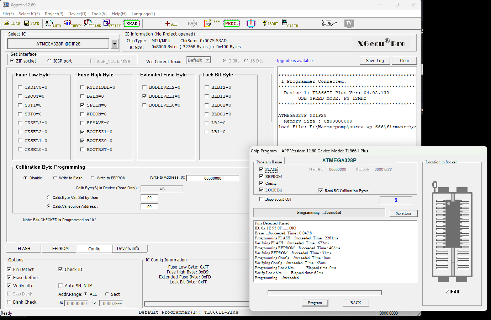

# AVR-firmware voor de IC2-socket

Hoort bij [../docs/volledige-controlbox.md](../docs/volledige-controlbox.md).

| Map | Fase | Wat het doet |
|---|---|---|
| `avr-bridge/` | 2 | **De echte brug.** Geeft OpenTherm door tussen thermostaat en CV-ketel, praat op 9600 baud met de ESP32 in de IC1-voet, en trekt zelf de noodbrug aan als die zwijgt. |
| `avr-diag/` | 1 | Luistert alleen. Telt flanken op de vier OpenTherm-kandidaatpinnen en rapporteert in ASCII over 9600 baud. Zendt niets. Achterhaald sinds de brug werkt. |

## De chip

Een **ATmega328P-PU in DIP-28** — dezelfde behuizing en pinout als de originele
ATmega8, dus hij past rechtstreeks in de voet. Vier keer zoveel flash en twee
keer zoveel RAM, en er is geen reden om jezelf op 8 kB vast te zetten.

Onder de IC2-voet ligt al een **8 MHz-kristal** op de print. Je hebt dus geen los
onderdeel nodig, alleen de juiste `lfuse`.

## De kant-en-klare hex

`avr-bridge/avr-bridge.hex` staat **wel** in git — precies zodat je hem kunt
branden zonder een Arduino-toolchain te installeren. Dat is een uitzondering op
`.gitignore`; alle andere bouwresultaten blijven eruit.

De hex hoort bij de bron ernaast. Verander je `avr-bridge.ino`, bouw hem dan
opnieuw en commit beide, anders lopen ze uit de pas.

## Bouwen zonder de IDE te openen

Er is geen MiniCore nodig. De meegeleverde AVR-core heeft al een
ATmega328P-definitie op 8 MHz: **Arduino Pro/Pro Mini, ATmega328P (3.3V, 8 MHz)**,
oftewel `arduino:avr:pro:cpu=8MHzatmega328`. Die zet `F_CPU` op 8000000 en
`mcu` op atmega328p, en meer hebben we niet nodig.

> De 3,3 V in die naam slaat alleen op het bord waar Arduino de definitie voor
> maakte. Wij draaien gewoon op 5 V; alleen de klokinstelling telt.

```bash
"/c/Program Files (x86)/Arduino/arduino-builder.exe" -compile \
  -hardware "C:\Program Files (x86)\Arduino\hardware" \
  -hardware "C:\Users\micha\AppData\Local\Arduino15\packages" \
  -tools "C:\Program Files (x86)\Arduino\tools-builder" \
  -tools "C:\Program Files (x86)\Arduino\hardware\tools\avr" \
  -tools "C:\Users\micha\AppData\Local\Arduino15\packages" \
  -libraries "C:\Users\micha\Documents\Arduino\libraries" \
  -fqbn=arduino:avr:pro:cpu=8MHzatmega328 \
  -build-path <bouwmap> \
  avr-bridge/avr-bridge.ino
```

Uit `<bouwmap>` heb je **`avr-bridge.ino.hex`** nodig. Níét de variant met
`with_bootloader` in de naam: die zet er een bootloader bij die wij niet
gebruiken en die de resetvector verlegt.

## Branden: twee wegen

| | Arduino Uno als ISP | TL866-II (Xgpro) |
|---|---|---|
| Kosten | niets, als je een Uno hebt | ~€80 |
| Bedrading | zes draadjes + een elco | chip in de ZIF-voet |
| Fuses | met de hand via avrdude | vinkjes in een venster |
| Valkuil | kip-en-ei met de klok, zie hieronder | geen |

Voor één chip is de Uno de logische keuze. De TL866 verdient zichzelf pas terug
als je vaker losse chips brandt.

## Branden met een Arduino Uno (ArduinoISP)

Laad eerst **Bestand &rarr; Voorbeelden &rarr; ArduinoISP** in de Uno. Daarna wordt
hij zelf de programmer.

| Uno | 328P-pin | |
|---|---|---|
| D13 | 19 | SCK |
| D12 | 18 | MISO |
| D11 | 17 | MOSI |
| D10 | 1 | RESET |
| 5V | 7 en 20 | VCC + AVCC |
| GND | 8 en 22 | |

Plus een **elco van 10 µF tussen RESET en GND van de Uno**, met de min aan GND.
Plaats die pas ná het uploaden van de ArduinoISP-sketch: zonder die condensator
reset de Uno zichzelf zodra avrdude de poort opent, en dan gebeurt er niets.

### Het addertje: kip en ei met de klok

ISP-programmeren werkt alleen als de doelchip **draait**. Onze `lfuse = 0xFF`
betekent "extern kristal", en zet je die op een breadboard zonder kristal, dan
is de chip daarna niet meer aanspreekbaar. Hij heeft geen klok meer.

Twee uitwegen:

- **Zet een kristal op het breadboard** (8 of 16 MHz met 2× 22 pF). Dan maakt de
  volgorde niet uit.
- **Of doe de fuses als laatste.** Een verse 328P staat op interne RC
  (`lfuse = 0x62`, 1 MHz), dus flashen kan meteen. Schrijf eerst de firmware,
  dan de fuses, en accepteer dat de chip daarna alleen nog in de controlbox
  werkt.

Bij die 1 MHz uit de fabriek moet avrdude worden afgeremd — de ISP-klok mag
hoogstens een kwart van de doelklok zijn. Voeg `-B 125` toe als je *not in sync*
krijgt.

### De commando's

```bash
avrdude -c avrisp -P COM5 -b 19200 -p m328p -B 125 -U flash:w:avr-bridge/avr-bridge.hex:i
```

```bash
avrdude -c avrisp -P COM5 -b 19200 -p m328p -U lfuse:w:0xFF:m -U hfuse:w:0xD9:m -U efuse:w:0xFD:m
```

Die `-b 19200` is de baudrate waarop de ArduinoISP-sketch praat, niet die van de
doelchip.

> **Gebruik niet "Bootloader branden" uit de IDE.** Dat lijkt de makkelijke weg,
> maar de Pro Mini 8 MHz-definitie zet `hfuse = 0xDA`, en daarin staat **BOOTRST
> geprogrammeerd**: de chip springt na een reset naar het bootloadergebied.
> Overschrijf je dat gebied daarna met onze firmware, dan start hij in een leeg
> stuk flash en doet hij niets. Vandaar `0xD9` — reset naar adres 0. Ben je die
> weg toch ingeslagen, zet de hfuse dan achteraf met avrdude recht.

## Branden met de TL866-II (Xgpro)

De programmer brandt de chip in zijn eigen ZIF-voet; er komt geen ISP-kabel en
geen bootloader aan te pas. Daarna druk je hem in de IC2-voet van de controlbox.



*Zo hoort het eruit te zien. Rechtsonder in **IC Config Information** staan de
vier bytes die moeten kloppen: `0xFF` / `0xD9` / `0xFD` / `0xFF`. In het
Extended Fuse Byte is alleen `BODLEVEL1` aangevinkt — dat is de brown-out op
2,7 V. Onder **Lock Bit Byte** blijft alles leeg; `0xFF` betekent niets
vergrendeld, en dat is wat je wilt. In de log zijn de twee regels die tellen
`ID: 0x 1E 95 0F ......OK!` (je hebt de juiste chip) en `Verifying FLASH
...Succeeded` (wat erin staat is wat je bedoelde).*

De exacte bewoording verschilt per Xgpro-versie, maar de stappen zijn deze:

1. **Chip plaatsen.** Hendel omhoog, chip erin met **pin 1 aan de kant van de
   hendel**, uitgelijnd op pin 1 van de voet — dus bovenaan, niet gecentreerd.
   Een DIP-28 laat de onderste rijen van de 40-pins voet leeg. Hendel omlaag.

2. **Chiptype kiezen.** *Select IC* → zoek op `ATMEGA328P` → kies de variant
   **`@DIP28`**. Let op de **P**: `ATMEGA328` en `ATMEGA328P` zijn verschillende
   signatures en de programmer weigert de verkeerde.

3. **Hex inladen.** *File → Open* → `avr-bridge/avr-bridge.hex`. Kies **Intel
   HEX** als het formaat gevraagd wordt. Je ziet de code in het buffervenster
   verschijnen; klopt dat niet, dan is het bestand niet geladen en brand je een
   lege chip.

4. **Fuses zetten** op het tabblad **Config**. Zie de tabel hieronder. Xgpro toont
   ze meestal als losse opties met namen (klokbron, brown-out, BOOTRST) en
   berekent daar het hex-getal bij; sommige versies laten je het getal direct
   invullen. Werk in beide gevallen naar de waarden uit de tabel toe en
   **controleer het resulterende hex-getal** voordat je verder gaat.

5. **Programmeren.** De programmeerknop (*Prog*, of `P`) opent een venstertje met
   aanvinkvakjes voor wat er geschreven wordt: FLASH, EEPROM, Config en LOCK
   Bit. Laat **Config aangevinkt staan** — anders schrijf je wel de firmware
   maar niet de fuses, en start de chip op de verkeerde klok.

   > **LOCK Bit mag ook gewoon aan.** Dat vinkje zegt alleen *dat* de lockbyte
   > geschreven wordt, niet wat erin komt; die waarde stel je in op het
   > Config-tabblad en daar staat `0xFF` = niets vergrendeld. Vink onder **Lock
   > Bit Byte** dus geen enkele bit aan. Zet je LB1 of LB2 wel aan, dan kun je
   > de flash niet meer teruglezen om te controleren wat er in de chip zit — en
   > dat wil je juist kunnen. Terugdraaien kan alleen met een chip erase.

6. **Verifiëren.** Xgpro doet dat zelf als je het aan laat staan. Lees daarna
   voor de zekerheid de fuses terug en vergelijk ze met de tabel.

> **Fuse-bits zijn omgekeerd.** Een `0` betekent *geprogrammeerd/actief* en een
> `1` betekent *uit*. Dat is de klassieke struikelsteen: `0xFF` op lfuse betekent
> niet "alles aan" maar "geen enkele deler of interne bron geselecteerd", oftewel
> extern kristal. Ga daarom altijd af op het hex-getal, niet op je gevoel bij de
> vinkjes.

## Fuses

Onder de IC2-voet ligt een **8 MHz-kristal** (nagekeken op de print), dus in de
controlbox draait de chip extern.

Onder de IC2-voet ligt een **8 MHz-kristal** (nagekeken op de print), dus in de
controlbox draait de chip extern.

| Fuse | Bureau (geen kristal) | In de controlbox |
|---|---|---|
| lfuse | `0xE2` | `0xFF` |
| hfuse | `0xD9` | `0xD9` |
| efuse | `0xFD` | `0xFD` |

`0xE2` is interne RC op 8 MHz zonder deler en werkt **zonder enig extern
onderdeel** — ideaal voor de bureautest. `0xFF` is extern kristal 8–16 MHz.

**Dezelfde `.hex` werkt in beide gevallen.** De klokbron is een fuse-instelling,
geen compileeroptie; `F_CPU` staat zo en zo op 8 MHz. Ga je van bureau naar
controlbox, dan hoef je alleen `lfuse` om te zetten.

Kies je extern terwijl er geen kristal is, dan doet de chip niets meer en is
niet te zien of het aan de firmware of aan de fuses ligt. Op het bureau is
interne RC dus de veilige kant. En andersom: de fabrieksinstelling van een verse
328P is `0x62` — interne RC op 8 MHz **gedeeld door 8**, dus 1 MHz. Laat je die
staan, dan loopt alles acht keer te traag: de OpenTherm-tik van 125 µs wordt
1 ms en er komt geen enkel frame doorheen.

> Laat **RSTDISBL** en **DWEN** met rust. Die maken van de resetpin een gewone
> I/O-pin, en dan komt een normale programmer er niet meer bij. Dit is de enige
> onherstelbare fout die je hier kunt maken.

Bij interne RC hoort een kanttekening: de RC-oscillator loopt op zo'n ±3%, en
voor een 9600-baud-UART heb je ongeveer ±2,5% totaal te verdelen. Voor de
bureautest met een USB-TTL-adapter is dat prima. Voor de uiteindelijke
interconnect naar de ESP32 wil je een kristal.
